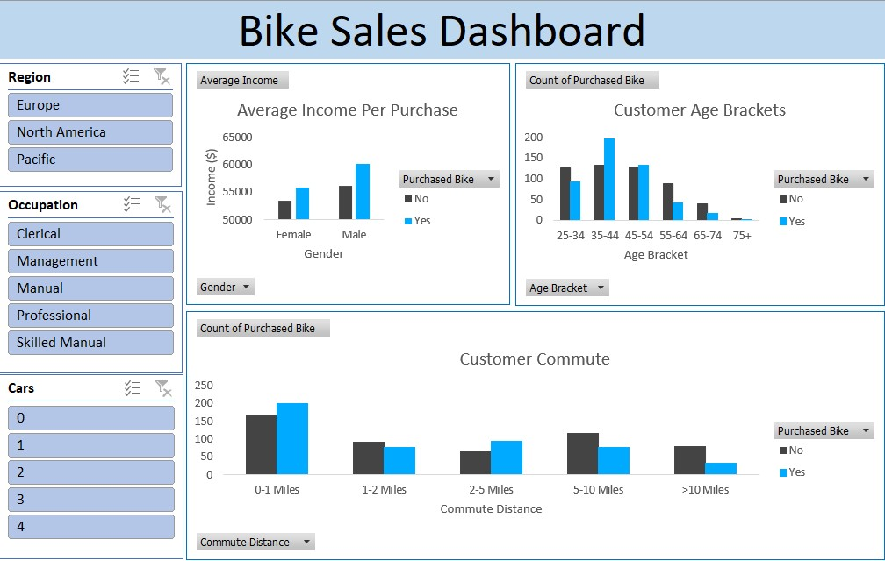

# Bike Sales Dashboard

This dashboard aims to visualise bike sales and was inspired by a walkthrough [video](https://www.youtube.com/watch?v=opJgMj1IUrc) created by Alex The Analyst.

## Requirements

- The original dataset can be accessed [here](https://github.com/AlexTheAnalyst/Excel-Tutorial) (saved using the file name 'Excel Project Dataset').
- The dashboard was created using Microsoft Excel 2016.

## Features

This dashboard can be used to visualise the:
- Average income of customers by gender per purchased bike.
- Age brackets and education levels of customers according to whether they purchased a bike or not.
- Commuting distances of customers according to whether they purchased a bike or not.

The dashboard can be filtered by:
- Region
- Occupation
- Number of cars
- Marital status.

## Skills

The following skills were used in this project:

- Data cleaning (e.g. removing duplicate observations and recoding the marital status and gender variables).
- Nested IF with multiple AND formula for creating the age brackets. The age brackets were taken from the [US Census Bureau](https://www.census.gov/data/tables/time-series/demo/income-poverty/cps-hinc/hinc-01.html) (2021).
- Pivot Tables and Pivot Charts.
- Selecting appropriate chart types for visualising the data.
- Customising the colour scheme. The 'yes' colour used #00abff came from the [yes colour palette](https://www.color-hex.com/color-palette/9676) and the 'no' colour #444444 came from the [no colour palette](https://www.color-hex.com/color-palette/377).
- Using slicers to filter the pivot tables by region, occupation, number of cars and marital status.

## Iterations

### Original dashboard created by Alex The Analyst

### My draft dashboard

### My final dashboard

